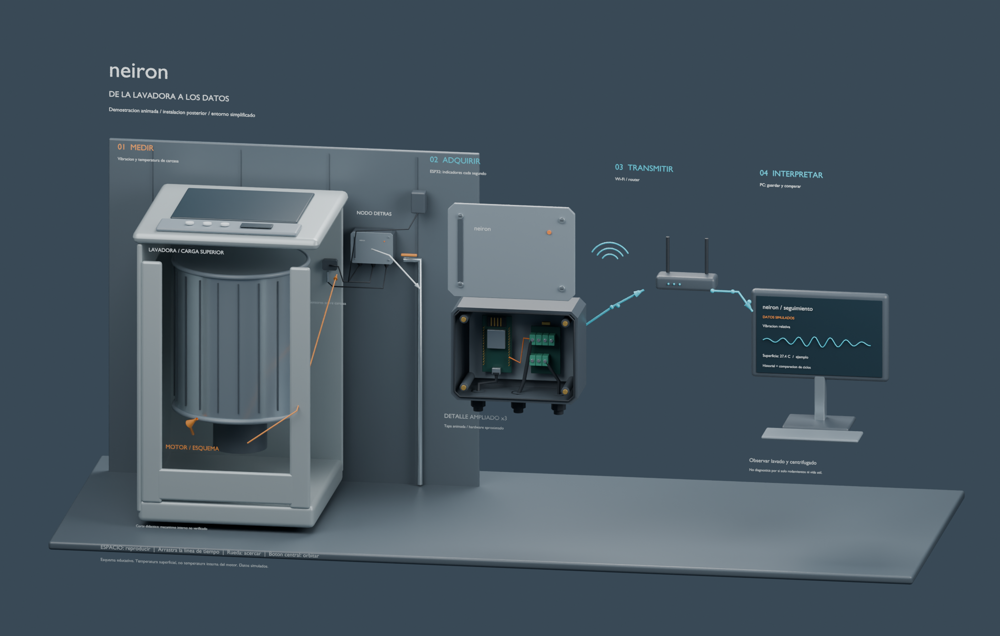
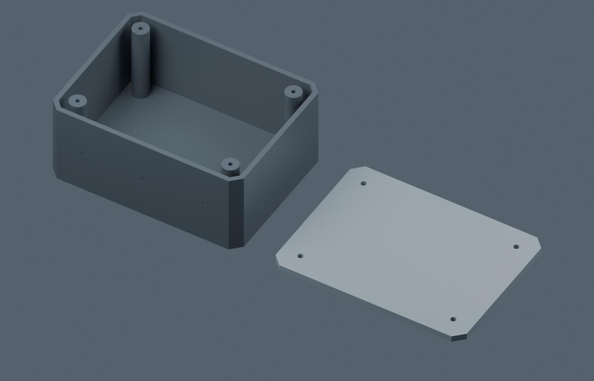

# neiron · Monitoreo IIoT de bajo costo

Proyecto de Javier ([javierah306-tech](https://github.com/javierah306-tech)) para explorar monitoreo de temperatura y vibración en activos de pequeñas empresas industriales. El primer banco de pruebas propuesto es una lavadora doméstica.

**Estado: diseño 3D v03 disponible; adquisición real, aplicación e integración de IA pendientes.** Las imágenes representan una demostración conceptual con datos simulados.

## Lo que ya existe

- Gabinete angular y modular con marca neiron, modelado en Blender.
- Escena animada que explica sensores → ESP32 → Wi-Fi → PC.
- Cuerpo y tapa independientes para una primera impresión de ajuste.
- Scripts para reproducir las escenas y documentación de sus limitaciones.

## Explorar

- Abrir `04_PROTOTIPOS_3D/blend_files/neiron_lavadora_demo_v03.blend` en Blender. Reproducir fotogramas 1–240.
- Abrir `04_PROTOTIPOS_3D/blend_files/neiron_carcasa_y_tapa_PRUEBA_v03.blend` para inspeccionar las dos piezas vacías.
- Consultar [guía de la entrega](04_PROTOTIPOS_3D/GUIA_ENTREGA_V03.md) y [scripts](03_SCRIPTS_BLENDER_CODEX/README_SCRIPTS.md).
- Consultar [arquitectura prevista](docs/ARQUITECTURA_SOFTWARE.md), [evaluación de MACHINA](docs/MACHINA.md) y [recorrido del proyecto](docs/ROADMAP.md).

Los generadores reinician su escena: ejecutarlos en un proceso independiente de Blender mediante `blender --background --python 03_SCRIPTS_BLENDER_CODEX/neiron_demo_v03.py`. Conservar copias si se han modificado manualmente los archivos de salida. La dependencia geométrica `prototipo_01_neiron_v02.py` está incluida.

## Prototipo físico previsto

ESP32 de 30 pines con Micro USB; MPU6050 externo para vibración; DS18B20 para temperatura superficial; adaptador externo USB de 5 V / 2 A. El gabinete se propone en pared detrás de la lavadora. Dimensiones nominales del conjunto: 120 × 90 × 55 mm.

Los STL son de prueba: cuerpo de 120 × 90 × 51 mm y tapa de 120 × 90 × 4 mm. Faltan junta, entradas definitivas, fijación mural y validación física. No se declara protección IP certificada ni diagnóstico predictivo validado. El movimiento interno de la lavadora es esquemático.

## Próxima etapa

Aplicación local editable, con simulador claramente identificado, almacenamiento de historial, alarmas dentro de la aplicación y formulario separado para intervenciones. La IA será opcional y permanecerá desactivada inicialmente; no hay una API de pago contratada ni modelos descargados como parte de esta entrega.

Este repositorio muestra avances de ingeniería; no es un producto industrial terminado. Se ha preparado una selección para publicación sin fotografías domésticas originales, respaldos completos ni datos de operación reales. La licencia del trabajo propio está pendiente de definición por su autor; la licencia de MACHINA no se aplica automáticamente a neiron.
