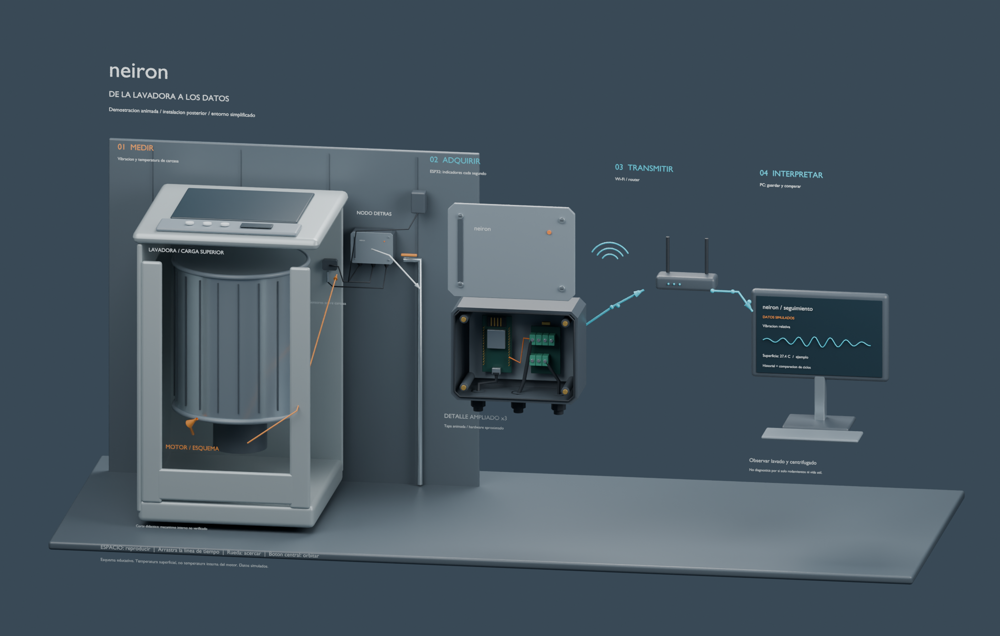
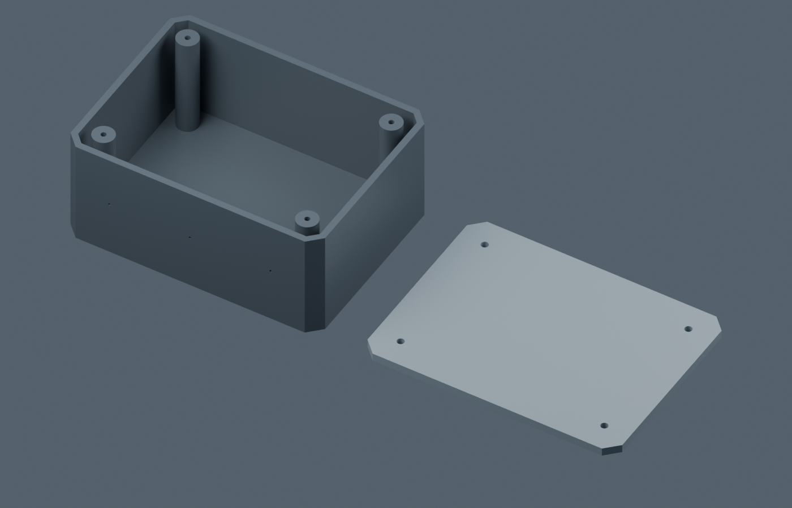

# neiron · Monitoreo IIoT de bajo costo

Proyecto de Javier ([javierah306-tech](https://github.com/javierah306-tech)) para explorar monitoreo de temperatura y vibración en activos de pequeñas empresas industriales. El primer banco de pruebas propuesto es una lavadora doméstica.

**Estado al 2 de octubre de 2026: diseño 3D v03, software neiron funcional y simulador autónomo Motor / Lab 1.0.0 con motor translúcido.** Todo el monitoreo disponible utiliza **DATOS SIMULADOS**. Hardware real y validación física pendientes; IA desactivada.

## Avance actual · Motor / Lab

Simulador Python **independiente y reutilizable** de motor monofásico de 5 HP → acoplamiento → bomba centrífuga de agua limpia. Funciona en Windows, en **127.0.0.1:8766**, con SQLite y web local; sin dependencias de terceros ni internet durante su operación.

- Temperatura superficial y aceleración RMS sintéticas en cuatro zonas: DE, NDE, carcasa y bomba.
- Condiciones de lubricación, contaminación del lubricante, desalineación, desequilibrio, fijación, defecto impuesto, ventilación y cavitación.
- Motor translúcido con opacidad regulable, vista exterior, acercamiento y siete componentes explorables. Rotor, estator, eje, ventilador y detalle de rodamientos visibles.
- Historial/CSV, evolución térmica gradual, pausa, apagado, pérdida de señal y recuperación con datos nuevos.
- REST, SSE y POST local opcional: el usuario decide cuándo conectarlo a otro programa.

**[Descargar código editable · ZIP](entregas/motor-lab-1.0.0-vista-mecanica.zip)** · [Guía y capturas](docs/MOTOR_LAB.md) · [Resultados y pruebas](docs/RESULTADOS_2026-10-02.md) · [SHA-256](entregas/SHA256SUMS.txt)

Extrae todo el ZIP, prepara Python 3.12 y abre `MotorLab/iniciar.bat`. Los lanzadores crean su entorno aislado; `cerrar.bat` guarda y cierra. La distribución se genera desde la única carpeta principal de desarrollo; no se mantiene aquí una segunda implementación del simulador.

**Verificación:** 23 pruebas automáticas del simulador y 25 comprobaciones en Edge (15 del recorrido completo y 10 de la vista mecánica), todas aprobadas; revisión funcional del autor con todas sus opciones. El motor interno y las marcas representan geometría y causas impuestas, no mediciones reales ni un diagnóstico validado.

## Lo que ya existe

- Gabinete angular y modular con marca neiron, modelado en Blender.
- Escena animada que explica sensores → ESP32 → Wi-Fi → PC.
- Cuerpo y tapa independientes para una primera impresión de ajuste.
- Scripts para reproducir las escenas y documentación de sus limitaciones.
- Aplicación [neiron P01](software/README.md) con monitoreo, historial, alarmas e intervenciones; lavadora simulada en 127.0.0.1:8765.

## Explorar

- Abrir `04_PROTOTIPOS_3D/blend_files/neiron_lavadora_demo_v03.blend` en Blender. Reproducir fotogramas 1–240.
- Abrir `04_PROTOTIPOS_3D/blend_files/neiron_carcasa_y_tapa_PRUEBA_v03.blend` para inspeccionar las dos piezas vacías.
- Consultar [guía de la entrega](04_PROTOTIPOS_3D/GUIA_ENTREGA_V03.md) y [scripts](03_SCRIPTS_BLENDER_CODEX/README_SCRIPTS.md).
- Consultar [arquitectura implementada y pendientes](docs/ARQUITECTURA_SOFTWARE.md), [evaluación histórica de MACHINA](docs/MACHINA.md) y [recorrido del proyecto](docs/ROADMAP.md).

Los generadores reinician su escena: ejecutarlos en un proceso independiente de Blender mediante `blender --background --python 03_SCRIPTS_BLENDER_CODEX/neiron_demo_v03.py`. Conservar copias si se han modificado manualmente los archivos de salida. La dependencia geométrica `prototipo_01_neiron_v02.py` está incluida.

## Prototipo físico previsto

ESP32 de 30 pines con Micro USB; MPU6050 externo para vibración; DS18B20 para temperatura superficial; adaptador externo USB de 5 V / 2 A. El gabinete se propone en pared detrás de la lavadora. Dimensiones nominales del conjunto: 120 × 90 × 55 mm.

Los STL son de prueba: cuerpo de 120 × 90 × 51 mm y tapa de 120 × 90 × 4 mm. Faltan junta, entradas definitivas, fijación mural y validación física. No se declara protección IP certificada ni diagnóstico predictivo validado. El movimiento interno de la lavadora es esquemático.

## Software local · 1 de octubre de 2026

Aplicación editable en [software](software/README.md): monitoreo, historial SQLite y CSV, alarmas con histéresis y reconocimiento, e intervenciones separadas. Abre `software/iniciar.bat` en Windows. Funciona exclusivamente en 127.0.0.1, sin dependencias de terceros ni internet. Los datos operativos quedan fuera del repositorio. Consulta el [contrato](software/CONTRATO_DATOS.md) y la [verificación](software/VERIFICACION.md).

## Próxima etapa

Validar firmware, muestreo, montaje y adquisición real con ESP32 de 30 pines, MPU6050 y DS18B20. La IA sigue desactivada; no se instaló MACHINA ni se descargaron modelos.

Este repositorio muestra avances de ingeniería; no es un producto industrial terminado. Se ha preparado una selección para publicación sin fotografías domésticas originales, respaldos completos ni datos de operación reales. La licencia del trabajo propio está pendiente de definición por su autor; la licencia de MACHINA no se aplica automáticamente a neiron.

## Antecedente · banco motor–bomba integrado 0.2.0

[Banco anterior y guía](software/SIMULADOR_MOTOR_BOMBA.md), conservado para trazabilidad: simulación y recepción en procesos separados pero dentro del paquete neiron, con perfiles/base distintos de la lavadora. La decisión vigente es **Motor / Lab autónomo**, sin conexión automática ni dependencia de neiron. Su entrega actual está enlazada arriba. Los iniciadores del banco anterior no son el inicio recomendado del simulador vigente.
