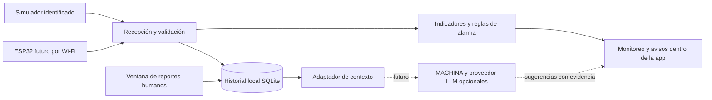

# Arquitectura prevista de neiron

Estado: diseño de integración; no hay aplicación funcional ni adquisición real en esta entrega.

## Aplicación local

Servicio local y pantalla en navegador, sin obligar a desplegar servicios comerciales. SQLite para activos, medidas, alarmas y reportes; adjuntos fuera de la base con identificadores y copias de respaldo. Retención y exportación configurables. El servicio de interfaz se limitará al equipo local; la futura entrada desde ESP32 tendrá autenticación y acceso de red acotado.

Vistas separadas: monitoreo del activo, historial, registro de intervención y configuración. Temperatura en °C y vibración con unidades y método claramente identificados. Gráficos sobrios, color acompañado de texto/icono y animaciones discretas. Estados explícitos: simulado, conectado, sin datos, alarma pendiente y alarma reconocida. Reconocer una alarma no borra su causa ni su historial.

## Contrato de datos a implementar

Cada paquete: versión de esquema, identificador del dispositivo y activo, número de secuencia, hora de adquisición y recepción, origen real/simulado y calidad de señal. Indicadores con unidad, intervalo y método de cálculo. Distinguir muestras crudas de resúmenes por ventana.

Enviar un paquete por segundo no significa muestrear vibración a 1 Hz. El muestreo, filtrado y cálculo RMS deberán definirse y validarse con el firmware. No etiquetar aceleración como velocidad en mm/s ni asignar umbrales industriales universales sin validar aplicación y medición.

Reportes humanos: activo, fecha de intervención y registro, autor, tipo de trabajo, observaciones, componentes afectados y adjuntos. Las correcciones conservarán trazabilidad. La incorporación a la base de conocimiento recupera documentos; no implica reentrenar automáticamente el modelo.

## Conexión futura de IA

Interfaz intercambiable del asistente con estado inicial `disabled`. Entrada: identificador de solicitud y activo, pregunta, ventana de indicadores, alarmas y referencias de reportes autorizados. Salida: estado, texto, referencias, limitaciones y propuestas pendientes de confirmación. Conservar versión del proveedor/modelo y tiempos para auditoría. Un modo de prueba debe identificarse como simulado.

MACHINA será un adaptador o servicio separado, sin acceso directo de escritura a la base principal. Cancelación, tiempo máximo y manejo de errores serán parte del contrato. El núcleo de alarmas y almacenamiento no dependerá de un LLM. Esta separación permite decidir después entre modelo local, servidor central o API sin rehacer la interfaz.
