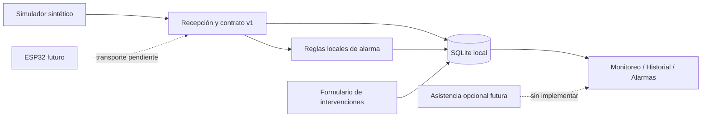
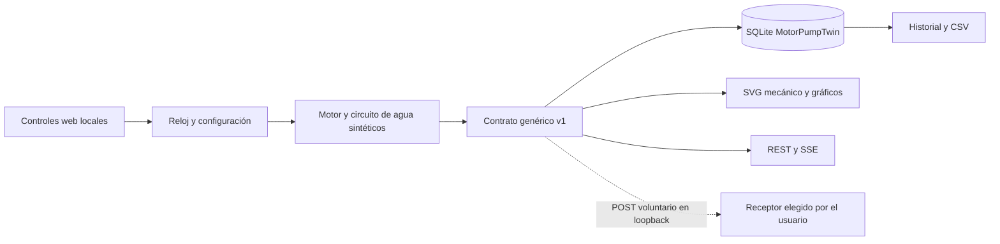

# Arquitectura local · neiron P01 y Motor / Lab

Estado al 2 de octubre de 2026: aplicación neiron y simulador autónomo Motor / Lab 1.0.0 implementados y probados con **datos simulados**. Diseño mecánico v03 conservado. Adquisición física pendiente e IA desactivada.

```mermaid
flowchart LR
  S[Simulador sintético] --> R[Recepción y contrato v1]
  R --> D[(SQLite local)]
  R --> K[Reglas locales de alarma]
  K --> D
  D --> U[Monitoreo / Historial / Alarmas]
  H[Formulario de intervenciones] --> D
  E[ESP32 futuro] -. transporte pendiente .-> R
  A[Asistencia opcional futura] -. sin implementar .-> U
```

Un proceso Python 3.12, un hilo de simulación cada ≈ 1 s, servidor HTTP de la biblioteca estándar y acceso SQLite serializado. Se eligió la biblioteca estándar porque cubre el alcance local sin instalar FastAPI u otras herramientas. Código principal único en `software/`, adecuado para el portafolio; datos en `%LOCALAPPDATA%\neiron\prototipo-01`, fuera de su contenido publicable. HTML/CSS/JavaScript y gráficos Canvas propios, fuentes del sistema e iconos de texto, sin CDN. Entorno virtual `.venv` y versión de referencia registrada.

El servidor escucha exclusivamente en 127.0.0.1. No hay microservicios, Docker, infraestructura remota ni sistema multiusuario. No habilita CORS y rechaza solicitudes con Host/Origin externos. Los errores del servidor se registran localmente. El almacenamiento utiliza transacciones SQLite; reconocimiento y cambios de configuración dejan eventos. El origen distingue simulado/real en el esquema, con recepción real expresamente deshabilitada.

Los estados son normal, alarma, simulación detenida, sin datos y error de sistema. Reconocer una alarma no recupera su causa. Las reglas de temperatura y aceleración RMS tienen duración mínima e histéresis. Ausencia se supervisa solo durante simulación iniciada; detener registra suspensión. Lecturas actuales se ocultan al vencer, detener o perder conexión. Los gráficos son historial identificado, nunca muestras reales. Todos los instantes en la base están normalizados a UTC con zona y se muestran en America/Santiago.

Se conserva el objetivo de firmware/ESP32 para una etapa futura. [Contrato implementado](../software/CONTRATO_DATOS.md), [guía](../software/README.md) y [pruebas ejecutadas](../software/VERIFICACION.md).

## Decisiones vigentes frente al diseño anterior

El documento anterior describía una arquitectura prevista, con reportes ampliados, adjuntos, retención configurable y asistencia opcional. Para esta primera entrega, la instrucción vigente del usuario centra el alcance en simulación, historial, alarmas e intervenciones sin adjuntos. Las intervenciones son inmutables; una corrección es una nueva entrada que cita el original. No se implementaron componentes afectados como campo separado, retención configurable, adjuntos ni adaptador de IA. Esas ideas siguen como antecedentes para evaluar, no como funciones disponibles.

MACHINA sigue siendo un candidato documental según [MACHINA.md](MACHINA.md). El núcleo funciona sin LLM, no instala MACHINA ni modelos y no depende de proveedores. La futura asistencia deberá conservar referencias, versiones, límites y confirmación humana; no podrá escribir directamente sobre reglas o historial. No hay predicción de fallas, vida útil ni diagnóstico validado.

## Antecedente · extensión integrada 0.2.0 de motor y bomba

El usuario solicitó una segunda aplicación HTTP independiente conectada a neiron. Se conservó un único código principal y se añadieron perfil motor/base separada, emisor local y proceso de simulación independiente. `motor_model` calcula física reducida y ventanas de aceleración; `motor_engine` avanza sin navegador/receptor, persiste y audita; `motor_transport` entrega a 127.0.0.1 y sincroniza secuencias, sin cola de datos antiguos; `motor_server` ofrece controles y vista SVG; `motor_lab` inicia/cierra ambos procesos. El receptor externo conserva contrato, SQLite, alarmas y las cuatro vistas; no usa el generador de lavadora. Todo sigue en biblioteca estándar y loopback. [Modelo, referencias y contrato](../software/SIMULADOR_MOTOR_BOMBA.md).

La instrucción posterior da independencia completa al banco. Los módulos 0.2 se conservan para trazabilidad, pero no son la aplicación vigente ni implican conexión automática de Motor / Lab a neiron.

## Implementación vigente · Motor / Lab 1.0.0

```mermaid
flowchart LR
  U[Controles web locales] --> E[Reloj y configuración]
  E --> M[Motor y circuito de agua sintéticos]
  M --> C[Contrato genérico v1]
  C --> D[(SQLite MotorPumpTwin)]
  C --> V[SVG mecánico y gráficos]
  D --> H[Historial y CSV]
  C --> R[REST y SSE]
  C -. POST voluntario en loopback .-> X[Receptor elegido por el usuario]
```

Un proceso Python estándar con HTTP en **127.0.0.1:8766**, hilo físico aproximadamente cada segundo y emisor opcional separado. No importa módulos neiron. Datos en `%LOCALAPPDATA%\MotorPumpTwin`, independientes de los perfiles/base neiron. Fuente principal en `07_SIMULADOR_MOTOR_BOMBA` del proyecto local y distribución ZIP reproducible en el portafolio.

| Módulo de la entrega `twin/` | Responsabilidad |
| --- | --- |
| `model.py` | Parámetros, hidráulica, inercia térmica y ventanas triaxiales sintéticas. |
| `contract.py` | Paquete con versión, identidad, secuencia, UTC, origen y calidad. |
| `engine.py` | Reloj, comandos, persistencia de estado y validez de lectura actual. |
| `storage.py` | SQLite para paquetes, estado y eventos de configuración. |
| `transport.py` | POST local voluntario; el fallo del receptor no detiene la planta. |
| `server.py` / `launcher.py` | HTTP, REST/SSE/CSV, inicio/reutilización/cierre y guardas de loopback/origen. |
| `static/app.*` | Controles, sensores, gráficos, estados y conexión optativa. |
| `static/mechanics.*` | Capas y acabados SVG, selección interior, opacidad, giro y efectos de causas impuestas. |

Las señales son temperatura superficial y RMS vectorial de aceleración (m/s², DC eliminado), en DE/NDE/carcasa/bomba. Las ventanas sintéticas tienen 1.000 Hz y 1 s; la tasa de publicación es aproximadamente 1 paquete/s. Configuración física acelerable a 1×/10×/60× sin acelerar el muestreo/publicación. La visualización no genera datos ni altera la física al cambiar transparencia o acercamiento.

Motor / Lab muestra referencias térmicas/de vibración **ilustrativas**, mientras las alarmas con reconocimiento e intervenciones pertenecen a neiron. El contrato autónomo y el del banco 0.2 no se deben asumir intercambiables: un receptor nuevo debe validar/adaptar explícitamente esquema, identidad y secuencia. Los ejemplos de la entrega demuestran un receptor genérico optativo.

Pausa/ausencia/error ocultan el paquete actual y congelan la animación; la planta puede continuar físicamente durante pérdida de telemetría. Reinicio conserva estado/historial, sin simular horas con el programa cerrado ni reactivar el envío. Instantes UTC y visualización America/Santiago. Sin CDN, CORS externo, IA, pagos, infraestructura industrial ni firmware conectado. [Entrega y límites](MOTOR_LAB.md).
