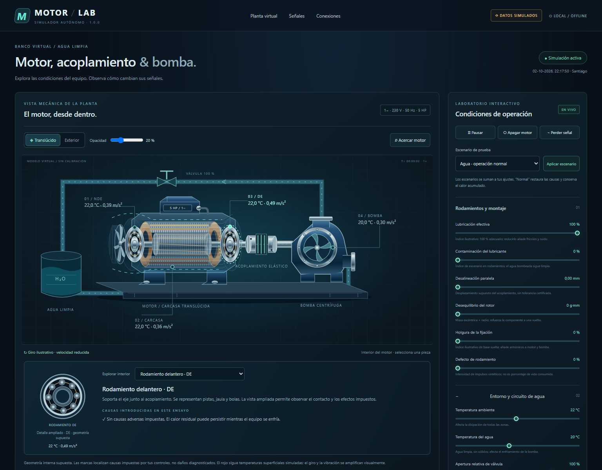
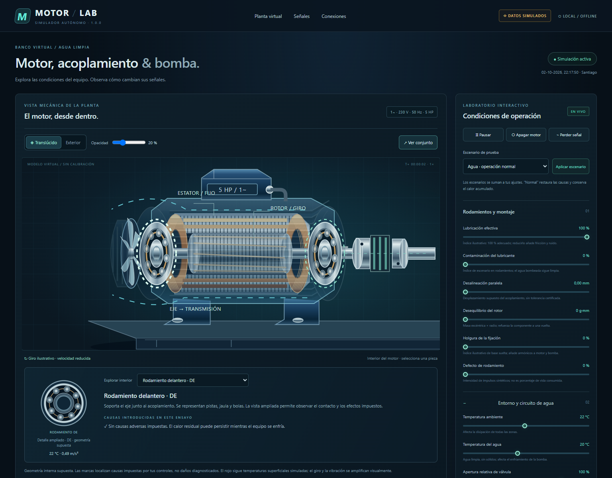
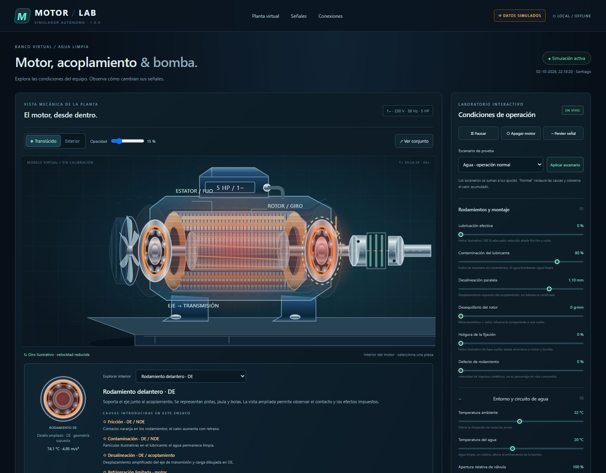

# Motor / Lab · simulador autónomo 1.0.0

Entrega vigente al **2 de octubre de 2026**, con revisión del motor translúcido. Desarrollado y probado en Windows por el proyecto neiron. El autor confirmó funcionamiento correcto tras recorrer todas sus opciones.

## Descargar y ejecutar

1. Descarga [motor-lab-1.0.0-vista-mecanica.zip](../entregas/motor-lab-1.0.0-vista-mecanica.zip). En GitHub utiliza el botón de descarga del archivo.
2. Extrae **todo** el archivo. Necesitas Python 3.12 disponible para tu usuario; referencia verificada: CPython 3.12.14 / SQLite 3.53.1. No se instala Python automáticamente.
3. Haz doble clic en `MotorLab/iniciar.bat`. Se crea `.venv` aislado sin paquetes externos ni descargas. Abre **http://127.0.0.1:8766**, únicamente en el PC que lo ejecuta; no es un sitio alojado en internet.
4. Usa `MotorLab/cerrar.bat` para guardar y cerrar el proceso. Cerrar la pestaña no detiene el servidor.
5. Si el puerto está ocupado: `iniciar.bat --port 8767`. Para ensayos separados, combina `--port` con `--data-dir`; no uses dos instancias sobre la misma base.

Datos por defecto: **`%LOCALAPPDATA%\MotorPumpTwin`**, fuera de la entrega y del repositorio. Conserva historial, secuencia, parámetros, temperaturas y tiempo físico al reiniciar. La salida HTTP opcional siempre vuelve desactivada. Después de disponer de Python, preparación y uso funcionan sin internet.

La entrega contiene fuentes, documentación, ejemplos, pruebas y lanzadores; incluye `ENTREGA.json` con el inventario y SHA-256 por archivo. Consulta [SHA256SUMS.txt](../entregas/SHA256SUMS.txt) para comprobar el ZIP. No contiene la base del autor, entorno virtual ni registros de operación.

## Explorar el interior

Pulsa **Acercar motor**, cambia **Opacidad** y selecciona una pieza en **Explorar interior** o en la planta. Los siete componentes son DE, NDE, estator, rotor, eje, ventilador y carcasa/fijación. Las lecturas y gráficos se sincronizan con la zona correspondiente. El detalle del rodamiento permite observar pistas, jaula y bolas.

| Ensayo | Representación y respuesta sintética |
| --- | --- |
| Operación normal | Arranque, giro, caudal y temperaturas que evolucionan gradualmente. Agua limpia. |
| Lubricación insuficiente | Contacto naranja en DE/NDE, más ruido y calor con retraso térmico. |
| Contaminación del lubricante | Partículas en los rodamientos; el agua sigue limpia. |
| Defecto impuesto | Marca de contacto e impulsos sintéticos; sin cálculo de daño acumulado. |
| Desalineación | DE/acoplamiento resaltados y aumento de la componente a dos vueltas. |
| Desequilibrio | Marcador excéntrico del rotor y aumento a una vuelta. |
| Fijación suelta | Pernos resaltados, movimiento de apoyos y armónicos sintéticos. |
| Ventilación limitada | Menos líneas de aire y acumulación progresiva de calor superficial. |
| Cavitación | Burbujas/ruido en la bomba y reducción de caudal según el modelo de NPSH. |
| Pausa o señal perdida | Se retiran las lecturas actuales y se detienen los efectos en vivo. Recuperación con paquetes nuevos. |

Los escenarios pueden combinarse. **Normal** restaura las causas y conserva el calor acumulado. Se puede acelerar el tiempo físico a 10× o 60×; la publicación sigue siendo aproximadamente un paquete por segundo. **Apagar motor** mantiene sensores virtuales mientras desacelera y enfría. La preferencia de movimiento reducido congela las animaciones.

## Señales e integración

Temperatura **superficial** en °C y RMS vectorial de **aceleración** en m/s², con media eliminada por eje. El modelo genera ventanas triaxiales de 1.000 puntos por eje a 1.000 Hz sintéticos; un paquete por segundo no es la frecuencia de muestreo. El indicador no se etiqueta como mm/s ni diagnóstico de rodamientos.

- `GET /api/latest`: paquete actual; 503 si no hay una lectura nueva válida.
- `GET /api/stream`: eventos SSE `telemetry` y `status`.
- `GET /api/history`: historial y filtros temporales.
- `GET /api/export.csv`: todas las zonas, unidades, calidad, origen y fechas UTC.
- POST opcional a un receptor elegido en 127.0.0.1, sin conectar automáticamente neiron.

El contrato incluye esquema/versión, instancia, dispositivo, activo, secuencia, adquisición UTC, origen `simulated`, calidad, revisión de configuración, reloj físico y zonas. Cada receptor asigna su hora de recepción y valida identidad, secuencia y formato. `API.md`, el receptor `examples/receiver.py` y el cliente `examples/read_latest.py` están en la entrega.

## Organización y alcance

El código principal de desarrollo continúa en `07_SIMULADOR_MOTOR_BOMBA` del proyecto local. El ZIP es una **distribución versionada**, generada por [empaquetar_motor_lab.py](../herramientas/empaquetar_motor_lab.py), sin una segunda carpeta editable mantenida dentro del portafolio. Para regenerarlo: `python herramientas/empaquetar_motor_lab.py --source "RUTA_A_LA_FUENTE"` con Python 3.12.

Python estándar para modelo, contrato, reloj, SQLite, HTTP y transporte; HTML/CSS/JavaScript, SVG y Canvas para interfaz. Sin servicios externos, IA, modelos descargados, CDN ni biblioteca gráfica obligatoria. Los ensayos de navegador usan Node/Playwright/Edge solo como herramientas de desarrollo.

La anatomía es genérica, con geometría de rodamientos supuesta. La localización visual procede de la **causa impuesta por el control**, no de una inferencia diagnóstica del RMS. El rojo utiliza temperaturas superficiales; no existe una medición de temperatura interna de bobina. Giro y vibración están amplificados para verse. La foto no identifica placa, geometría interna ni curvas reales. Hardware, calibración y validación industrial continúan pendientes.

Ver [resultados y verificaciones](RESULTADOS_2026-10-02.md) y [arquitectura](ARQUITECTURA_SOFTWARE.md).
